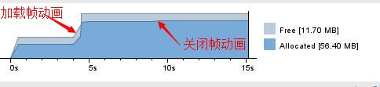

# FrameAnimationView

> 优化帧动画加载的内存占用、解决帧动画销毁内存不释放的问题

### 帧动画的两大弊端
+ 启动时加载所有图片，内存暴增
+ 帧动画停止后无法回收内存

### 默认帧动画

### 使用FrameAnimationView加载同样动画

### 加载原理
+ 每次只加载接下来要展示的图片
+ 使用重复的内存区块读取图片，防止内存抖动，减轻申请内存区块，加快图片加载速率
+ 使用内存缓存加载的图片，查看动画加载图片是否在内存中

# 使用方法
	
+ 使用FrameAnimView控件，继承RecyclingImageView
	+ FrameAnimView:animSrc="@drawable/anim_loading"
+ 自定义RecyclingImageView控件

# 项目添加方法
在根 build.gradle中添加

	allprojects {
		repositories {
			...
			maven { url 'https://jitpack.io' }
		}
	}
在项目build.gradle中添加

	dependencies {
	    compile 'com.github.ronghao:FrameAnimationView:1.0.0'
	}

# 关于
+ 个人博客：[www.haohaohu.com](http://www.haohaohu.com/)
+ 如果你也喜欢这个库，Star一下吧，欢迎Fork